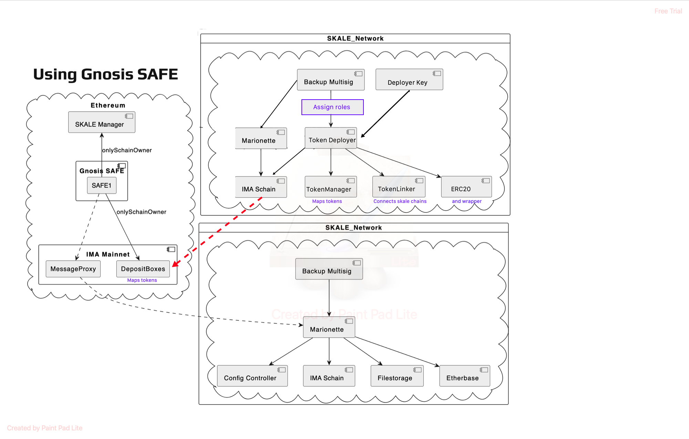

# Skale Roles
I recommend giving `DEFAULT_ADMIN_ROLE` to a secure private key for the following skale-predeployed-contracts using the predeployed Skale MSW. After that, you can easily grant roles to other developers or newly deployed smart contract such as the [Token-Deployer](https://github.com/RubyAquaMarine/skale-token-deployer)
- TokenManager, TokenLinker, ConfigController, 


# Scripts
make keys.json
```javascript
{
    "account": {
      "privateKey": "c7d02615d6a7391257a-",
      "privateKeyAdmin": "c7d02615d6a7391-"
    }
}
```

# Run

- set ```rconfig.rpc.staging_europa``` and ```credentials.account.privateKey``` within any script
- run any script from ```/roles``` 

```shell
npm install
npm run grant
npm run check

```

 within  `/roles/`, change the `CHECK_ADDRESS_ROLE` to any address that you would like to check the `currently assigned roles`, or an address that you would like to `assign new roles` to. 


## Node and NPM verions
node: v18.12.1
npm: 8.19.2

# Skale-Chain-UI
If you already have a private key with `DEFAULT_ADMIN_ROLE` on TokenManager, TokenLinker , then you can proceed to the Skale-Chain-UI to assign the two necessary roles for the Token-Deployer
- [repo](https://github.com/skalenetwork/admin-ui)
- [url](https://admin-ui-skale.vercel.app/role_assigner)

# Role Assignment Flow-chart
The purpose of the `Token-Deployer` is to simplify the process of onboarding L1 tokens to EuropaHub in a gas-free manner and allow other Skale chains to map EuropaHub tokens to their chain within one on-chain transaction. 
- Use the backup Multisig for `grantRoles` to the Token-Deployer address. Then use the Multisig or deployer key to deploy and map `ERC20 tokens` easily.
- - Suggestion (red-dotted-line) : allow IMA-Schain to communicate with L1 `depositbox.addERC20byAdmin()` to complete all necessary mainnet to skale chain mapping, ERC20 clone deployment, mapping L2 to L1, and ERC20 wrapper deployment within one transaction from L2.

Below you will see the common transaction flow using GnosisSafe MSW to assign roles on L1(left image) and L2(bottom image) while interacting on Ethereum. 

The proposed flow-chart (top image) will only use the Skale-Network for token deployments and token mapping. 
- `IMA Schain` needs to communicate with `IMA Mainnet.depositBoxERC20`



